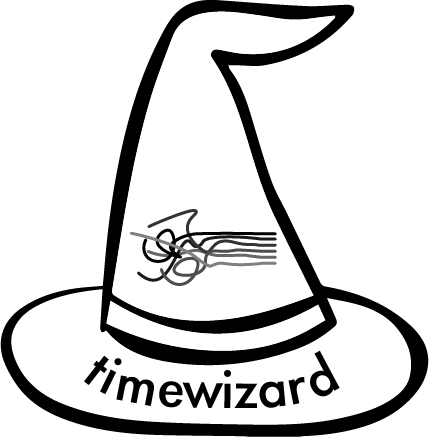

Timewizard is a Python library that makes it easier to work with timeseries data, especially in the context of neuroscience. 

Timewizard **can** help you cast the following spells:
* align data sampled at different rates
* align matched events across two different data streams
* collect peri-event traces of any-dimensional data
* enumerate peri-event events (i.e. lick times relative to a stimulus)
* describe stimulus trains (i.e. onsets and durations of complex optogenetic stimuli)

Timewizard **will not** help you to:
* synchronize your data (i.e. make sure that some time t=t0 refers to the same real moment in all your timeseries). This is your responsibility! (Although timewizard can help you verify that you've done it correctly.)
* plot your data (there are libraries for that!)
* run downstream analysis

Timewizard also provides a convenient collection of cute charms (achem -- utilities):
* round to a multiples (i.e. nearest multiple of 10)
* check if a matrix is symmetric
* check if an array is sorted
* describe runs of values in your data
* hierarchically cluster a distance or correlation matrix

To use timewizard, your data **must** meet the following minimal (and hopefully straightforward) standards:
* have time along the 0-th axis
* be sorted along the time axis

Timewizard's core alignment functionality is modified from code originally written by the folks at the Allen Institute for their [Brain Observatory data](https://github.com/AllenInstitute/brain_observatory_utilities). Functions modified directly from their code are licensed under the Allen Institute License. All other code is provided under the MIT license.

## Why?
Timewizard provides mid-level, modality-agnostic functions that help you work with timeseries. Everything is done with binary searches, meaning execution speed is very fast and doesn't require a GPU. You don't need to learn any new OO APIs. You just pass it your data, wave the wand, and get back some useful reorganization or information about your data. If you're looking for help running standard neuroscience analyses, you might check out [pynapple](https://github.com/pynapple-org/pynapple/tree/main).

## Install

For now, clone the repo and use `pip install -e .` from inside the repo.

## Examples
TODO

## Roadmap
* allow mmap and lazy evaluation à la spike interface (and many others)
* re-factor edge case handling -- still a bit buggy and the code is sloppy
* 

## Citataions
Witch icons created by [Freepik - Flaticon](https://www.flaticon.com/free-icons/witch)

